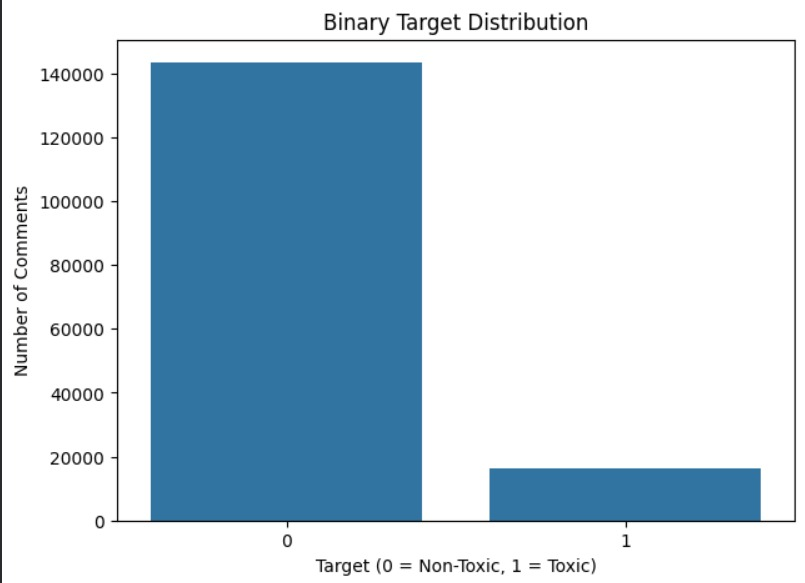
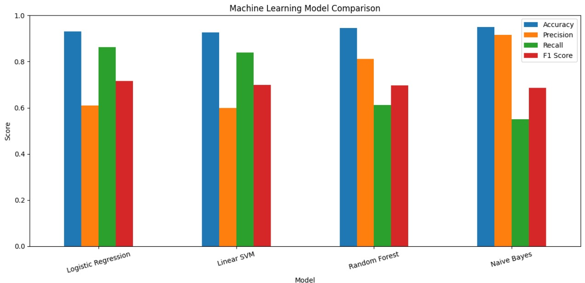
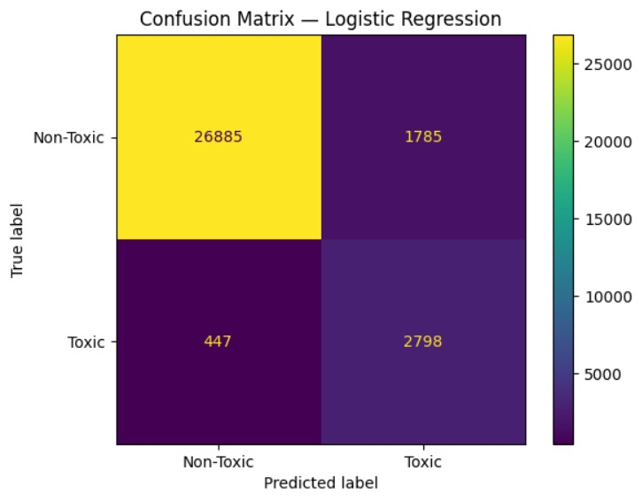

<div align="center">

# Toxicity & Hate Speech Detection System

### Binary Toxic Comment Classification using NLP and Machine Learning

<p>
  <a href="https://jyotipal40.github.io/Toxicity-Detection-System/#project-video">
    
  </a>
  <a href="https://youtu.be/hu2tvuUqd5k">
    
  </a>
  <a href="https://app.notion.com/p/385cea32a8db8013bcdff33ee6cefa7f?source=copy_link">
    
  </a>
</p>

<p>
  <b>Internship Project</b> · <b>Jyotipal Mahanta</b>
</p>

</div>

---

## Overview

The **Toxicity & Hate Speech Detection System** is an internship project focused on automatically identifying toxic online comments using **Natural Language Processing (NLP)** and classical machine learning.

The project uses the **Jigsaw Toxic Comment Classification** dataset, converts its six toxicity-related annotations into a binary target, transforms cleaned text into numerical representations using **TF-IDF**, and compares multiple machine learning classifiers.

The final model used for the project is **Logistic Regression**, selected using **F1 score** because the binary target is highly imbalanced.

> **Important:** The project is branded as a toxicity and hate-speech detection system, but the implemented machine-learning task is specifically **binary toxicity classification**: `NON-TOXIC (0)` vs `TOXIC (1)`. The original six Jigsaw labels are used to construct this binary target rather than being predicted independently.

---

## Project at a Glance

| Component | Details |
|---|---|
| Problem | Binary toxic-comment classification |
| Dataset | Jigsaw Toxic Comment Classification |
| Original labels | 6 toxicity-related categories |
| Target | 0 = Non-Toxic, 1 = Toxic |
| Text processing | Lowercasing, URL removal, character cleaning, stopword removal |
| Feature extraction | TF-IDF |
| Maximum features | 10,000 |
| N-grams | Unigrams + Bigrams |
| TF scaling | Sublinear |
| Train/Test split | 80/20 stratified |
| Models compared | Naive Bayes, Logistic Regression, Linear SVM, Random Forest |
| Selected model | Logistic Regression |
| Selection criterion | F1 Score |
| Accuracy | 93.01% |
| Precision | 61.05% |
| Recall | 86.23% |
| F1 Score | 71.49% |

---

## System Workflow

```text
Jigsaw Dataset
      │
      ▼
Six Original Toxicity Labels
      │
      ▼
Binary Target Creation
0 → NON-TOXIC
1 → TOXIC
      │
      ▼
Text Cleaning
Lowercase → URL Removal → Character Cleaning → Stopword Removal
      │
      ▼
80/20 Stratified Train/Test Split
      │
      ▼
TF-IDF Vectorization
10,000 Features · Unigrams + Bigrams · Sublinear TF
      │
      ▼
Model Training & Evaluation
      │
      ├── Multinomial Naive Bayes
      ├── Logistic Regression
      ├── Linear SVM
      └── Random Forest
      │
      ▼
Logistic Regression
      │
      ▼
TOXIC / NON-TOXIC
```

### Data Leakage Prevention

The dataset is split **before TF-IDF fitting**. The vectorizer is fitted only on the training text, and the held-out test text is transformed afterwards.

This prevents information from the test set from influencing the learned TF-IDF vocabulary and weights.

---

## Dataset

The project uses the **Jigsaw Toxic Comment Classification** dataset containing Wikipedia comments annotated across six toxicity-related labels:

- `toxic`
- `severe_toxic`
- `obscene`
- `threat`
- `insult`
- `identity_hate`

### Binary Target Construction

The six original labels are combined into one target:

```text
If any of the six toxicity labels = 1
        ↓
Target = 1 (TOXIC)

If all six labels = 0
        ↓
Target = 0 (NON-TOXIC)
```

This produces a binary classification problem suitable for the final model comparison.

---

## Class Imbalance

The target distribution is strongly imbalanced, with substantially more non-toxic comments than toxic comments.



Because of this imbalance, **accuracy alone is not sufficient** for model selection. Precision, recall and especially F1 score provide additional information about how well the models identify the minority toxic class.

---

## Text Preprocessing

Before feature extraction, comments undergo a lightweight cleaning pipeline:

1. Convert text to lowercase
2. Remove URLs
3. Remove non-alphabetic characters
4. Remove English stopwords

The objective is to reduce irrelevant textual variation while preserving useful linguistic information for classification.

---

## TF-IDF Feature Extraction

TF-IDF converts each cleaned comment into a numerical feature vector.

The implementation uses:

- **Maximum features:** 10,000
- **N-gram range:** `(1, 2)`
- **Sublinear TF scaling:** enabled

### Core formulation

**Term Frequency**

```text
TF(t,d) = count(t,d) / total terms in d
```

**Inverse Document Frequency**

```text
IDF(t) = log(N / df(t))
```

**TF-IDF**

```text
TF-IDF(t,d) = TF(t,d) × IDF(t)
```

The resulting sparse feature matrix is passed to the machine-learning classifiers.

---

## Models Compared

Four classifiers were trained and evaluated:

1. **Multinomial Naive Bayes**
2. **Logistic Regression**
3. **Linear SVM**
4. **Random Forest**

The models were compared using:

- Accuracy
- Precision
- Recall
- F1 Score

### Results

| Model | Accuracy | Precision | Recall | F1 Score |
|---|---:|---:|---:|---:|
| Logistic Regression | 93.01% | 61.05% | **86.23%** | **71.49%** |
| Linear SVM | 92.66% | 59.95% | 83.85% | 69.91% |
| Random Forest | 94.60% | 81.16% | 61.08% | 69.70% |
| Naive Bayes | **94.91%** | **91.67%** | 54.95% | 68.71% |

### Model Selection

**Logistic Regression** was selected because it achieved the highest **F1 score (71.49%)** among the evaluated models.

The selection was therefore not based on accuracy alone, which is particularly important for this imbalanced classification task.

---

## Model Comparison



The comparison illustrates the trade-off between accuracy, precision, recall and F1 score across the four classifiers.

---

## Confusion Matrix

The final Logistic Regression model produced the following confusion matrix on the held-out test set:



| | Predicted Non-Toxic | Predicted Toxic |
|---|---:|---:|
| **Actual Non-Toxic** | 26,885 | 1,785 |
| **Actual Toxic** | 447 | 2,798 |

From these values:

- **True Negatives:** 26,885
- **False Positives:** 1,785
- **False Negatives:** 447
- **True Positives:** 2,798

The relatively high toxic-class recall reflects the model's ability to identify a substantial portion of the toxic comments in the held-out test set.

---

## Final Prediction Pipeline

For a new comment, the inference flow is:

```text
Raw Comment
    ↓
Text Cleaning
    ↓
TF-IDF Transformation
    ↓
Trained Logistic Regression
    ↓
Prediction
    ↓
TOXIC / NON-TOXIC
```

Example:

```text
Input:
"This is a horrible and hateful comment"

Output:
TOXIC
```

The notebook also demonstrates predictions on non-toxic examples such as:

```text
"I am happy with my life"
"Thank you for your help"
```

---

## Repository Structure

```text
Toxicity-Detection-System/
│
├── README.md
├── index.html
├── style.css
├── Toxicity_Hatespeech_Detection.ipynb
│
└── assets/
    ├── class-imbalance.png
    ├── confusion-matrix.png
    └── model-comparison.png
```

### Files

| File | Purpose |
|---|---|
| `Toxicity_Hatespeech_Detection.ipynb` | Complete data processing, feature extraction, model training and evaluation workflow |
| `index.html` | Project showcase webpage |
| `style.css` | Styling and animations for the project webpage |
| `assets/` | Evaluation and visualization figures |

---

## Technology Stack

### Machine Learning & NLP
- Python
- Scikit-learn
- TF-IDF
- Logistic Regression
- Multinomial Naive Bayes
- Linear SVM
- Random Forest

### Data & Visualization
- Pandas
- NumPy
- Matplotlib
- Seaborn

### Project Presentation
- HTML5
- CSS3
- GitHub Pages
- Jupyter Notebook
- Notion

---

## Running the Project

### 1. Clone the repository

```bash
git clone https://github.com/jyotipal40/Toxicity-Detection-System.git
cd Toxicity-Detection-System
```

### 2. Install the required Python packages

```bash
pip install pandas numpy scikit-learn matplotlib seaborn nltk joblib
```

### 3. Open the notebook

```bash
jupyter notebook Toxicity_Hatespeech_Detection.ipynb
```

Run the notebook cells sequentially to reproduce the preprocessing, TF-IDF vectorization, model training, evaluation and sample predictions.

> The notebook expects the relevant Jigsaw dataset files to be available in the environment used for execution.

---

## Project Showcase

🌐 **Project Website**  
https://jyotipal40.github.io/Toxicity-Detection-System/

🎥 **Project Walkthrough**  
https://youtu.be/hu2tvuUqd5k

📓 **Jupyter Notebook**  
`Toxicity_Hatespeech_Detection.ipynb`

📚 **Project Documentation**  
https://app.notion.com/p/385cea32a8db8013bcdff33ee6cefa7f?source=copy_link

---

## Limitations

- The implemented task is binary toxicity classification rather than independent prediction of all six original toxicity categories.
- The model is trained on the Jigsaw dataset and may not generalize equally well to every type of modern online communication.
- TF-IDF represents text statistically and does not capture contextual language understanding in the way transformer-based language models can.
- There is no deployed web or application interface in the current project.

---

## Future Improvements

Possible extensions include:

- Multi-label prediction for all six original toxicity categories
- Transformer-based models such as BERT-family architectures
- Context-aware toxicity detection
- Better handling of slang, spelling variations and multilingual text
- Threshold optimization for different moderation requirements
- Deployment as a REST API or web application
- Continuous evaluation on newer real-world comment datasets

---

## Credits

**Student Intern**  
**Jyotipal Mahanta** · Gauhati University

**Faculty Advisor**  
**Prof. Prithwijit Guha** · IIT Guwahati

**Mentors**  
**Mohd. Amaan** · IIT Guwahati  
**Ashwin Jacob Gigo** · IIT Guwahti

---

<div align="center">

### Toxicity & Hate Speech Detection System

*An internship project exploring NLP-based toxic comment classification.*

<br>

**Built with Python · NLP · TF-IDF · Machine Learning**

</div>
